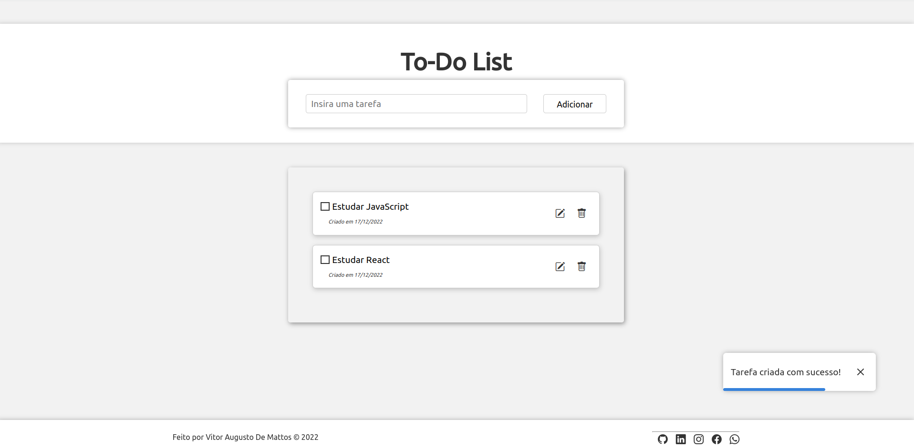
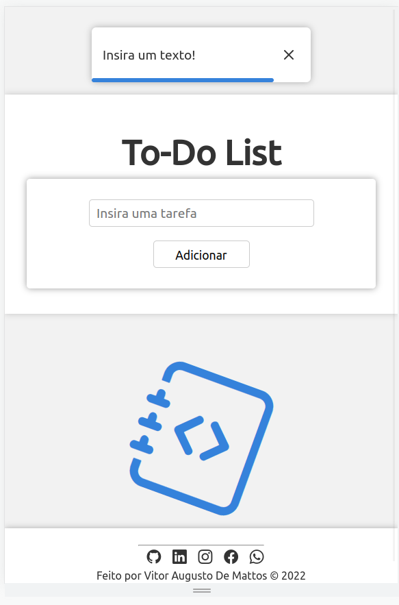
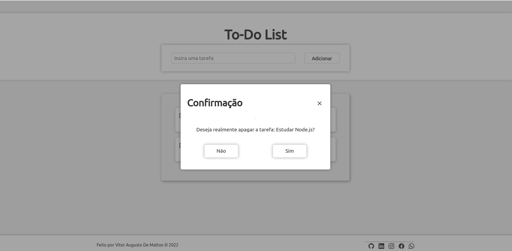
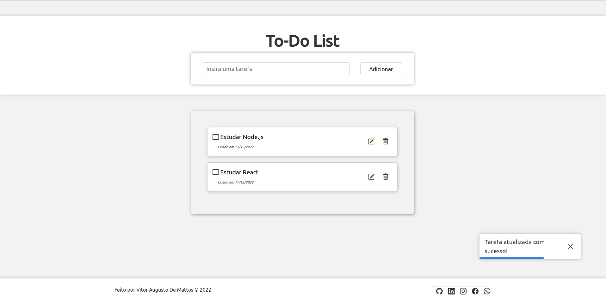
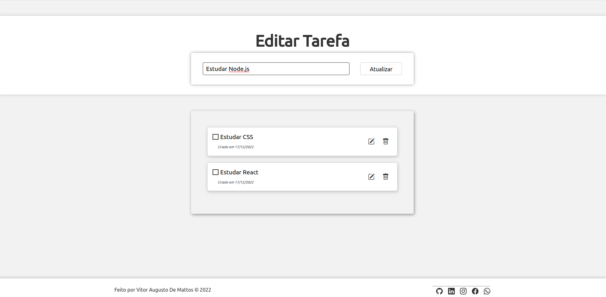

<h1 align="center"><a href="#"> 💻 Projeto Todo List</a></h1>

<p align="center">
Projeto Todo List, é uma lista de tarefas, de coisas que precisam ser feitas. É uma forma de organizar as atividades que não podem ser esquecidas, e que não estão inseridas na nossa rotina. É diferente de uma agenda, onde as atividades tem dia e hora para acontecer.

</p>

<p align="center">
  <a href="#-tecnologias">Tecnologias</a>&nbsp;&nbsp;&nbsp;|&nbsp;&nbsp;&nbsp;
  <a href="#-projeto">Projeto</a>&nbsp;&nbsp;&nbsp;|&nbsp;&nbsp;&nbsp;
  <a href="#-Como executar">Como executar</a>&nbsp;&nbsp;&nbsp;|&nbsp;&nbsp;&nbsp;
  <a href="#memo-licença">Licença</a>
  
</p>

<p align="center">
  
</p>

<br>

<p align="center">
  
</p>

<p align="center">
  
</p>

<p align="center">
  
</p>
<p align="center">
  
</p>
<p align="center">
  
</p>

## 🛠️ Tecnologias/ Ferramentas

Esse projeto foi desenvolvido com as seguintes tecnologias:

- [JavaScript](https://developer.mozilla.org/pt-BR/docs/Web/JavaScript)
- [Node.Js e NPM](https://nodejs.org/)
- [Express.Js](https://expressjs.com/pt-br/)
- [nodemon](https://www.npmjs.com/package/nodemon)
- [mongoose.Js](https://mongoosejs.com/)
- [MongoDB](https://www.mongodb.com/atlas/database)
- [Dotenv](https://www.npmjs.com/package/dotenv) 
- [Insomnia](https://insomnia.rest/)
- [EJS](https://ejs.co/)
- [Bootstrap](https://getbootstrap.com/)

## 📃 Projeto

<p>Uma lista de tarefas pode ser uma ferramenta útil para se manter organizado e em dia com suas responsabilidades. Também pode ser uma boa maneira de garantir que você não se esqueça de tarefas ou prazos importantes. Portanto, é uma ferramenta muito útil para a vida pessoal e profissional.</p>
<p>TO-DO List foi feito com Node.js, JavaScript onde é possível persiste os dados no Banco de Dados MongoDB, colocando em prática um CRUD usando as rotas do Express.JS, e renderizando com EJS.</p>


## ⚙️ Como executar 


Você precisa ter instalado as seguintes ferramentas: Node.js, Insomnia.

Será necessário que a porta 3000  estejam disponíveis para a aplicação.

1 - Clone o repositório em uma pasta de sua preferencia 
```
git@github.com:ViitorAugusto/Full-Stack.git
```
2 - Entre na pasta `TodoList`
```
npm install  // todas as depêndencias serão automaticamente instaladas.
```
3 - Use o comando
```
npm start // para inicar a aplicação
```


3 - Após rodar o comando, aguarde um pouco que a aplicação irá ficar disponivel nas seguintes rotas:


  `- Back End: http://localhost:3000`


## 🚀 memo: Licença

Esse projeto está sob a licença MIT.

---

Feito por Vitor Augusto [Linkedlin.](https://www.linkedin.com/in/viitoraugusto/)


